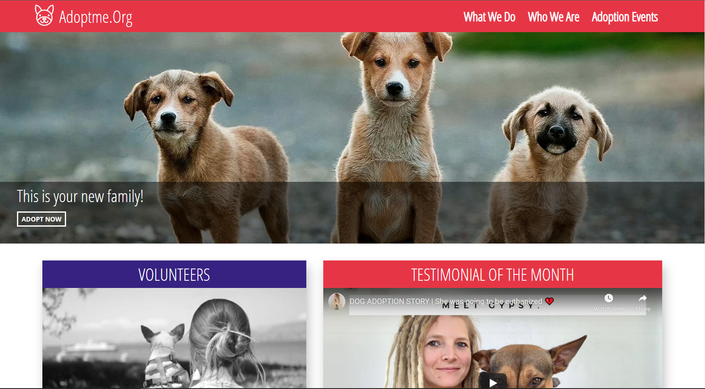
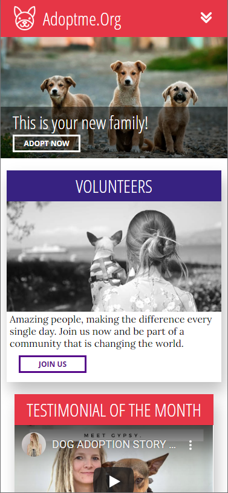

<p align="center">

</p>

# Adoptme.Org - Landing Page for Pet Adoption Organization

The Adoptme.Org landing page was created as a kata-like front-end project for Base22 and has limited functionality beyond the visual. The project was built in vue.js and uses multiple componentd and views to render a modern-looking webpage for an adoption organiztion. The Testimonial of the Month section calls a fake API to get the video URLs, which are hard-coded to switch randomly each time the page is loaded. The video uses a responsive iFrame to maintain aspect ratio of the original videos. The primary focus of the production was ensuring quality look and feel on devices of all sizes, including tablets and mobile phones. To do this, I used @Media queries in the CSS to change sizes and flexbox columns/rows. The webpage was built with a "mobile-first" mentality, adding rules to adapt to larger screens when necessary.



## Getting Started

This website is not currently deployed and is not meant to be client-facing, but you can run a development server on your localhost for testing and experimentation.


### Prerequisites
1. A JS/HTML editor such as [Visual Studio Code](https://code.visualstudio.com/)
2. [Node.js / npm](https://www.npmjs.com/get-npm)
3. [Vue.js](https://vuejs.org/) (Likely installs with the rest of the project using NPM. If not: )
```
npm install @vue/cli
```

### Installation

1. Clone this repository to your local machine or download it.
2. Navigate to the <a href="AdoptMe/adoptme">adoptme</a> folder.
5. Open Terminal and run 
```
npm install
```
and then 
```
npm run serve
```

6. Navigate to http://localhost:8080/ and start interacting with the Adoptme.Org webpage!

## Usage
* See a random Adoption Testimonial from Youtube on each page load. 
* View it on a small screen for a unique mobile experience.



## Contributors
* [Kolton Nay](https://www.linkedin.com/in/koltonnay/) Specialty: Vue.js

## Built With
* [Visual Studio Code](https://code.visualstudio.com/) - Code Editor
* [Vue.js](https://vuejs.org/) - Front-End Development
* [Node.js / npm](https://nodejs.org/en/) - Package Management
